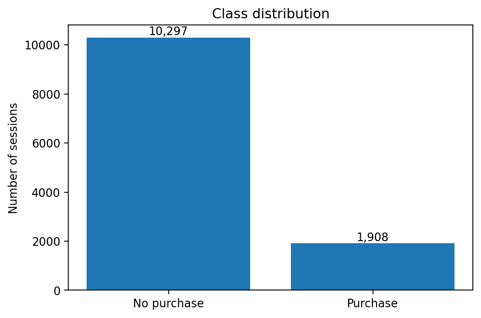
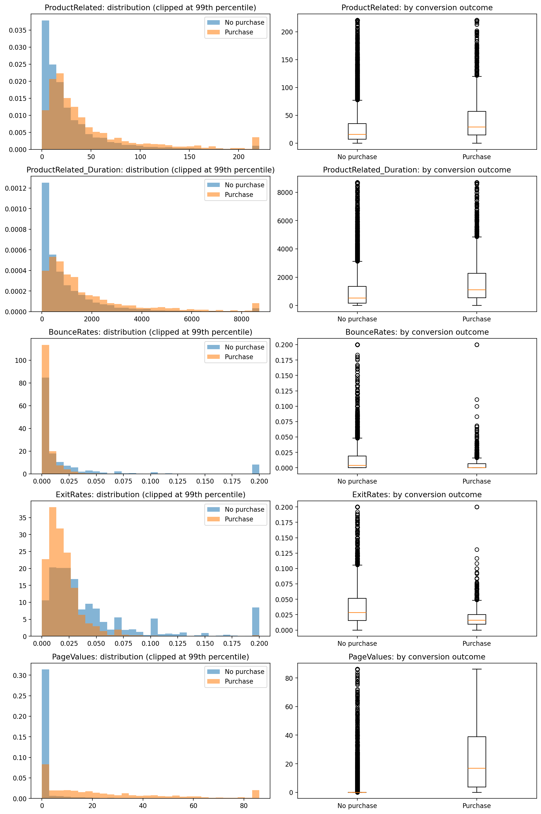
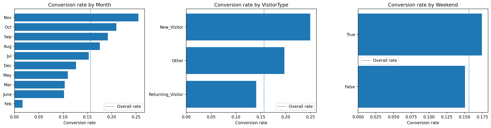
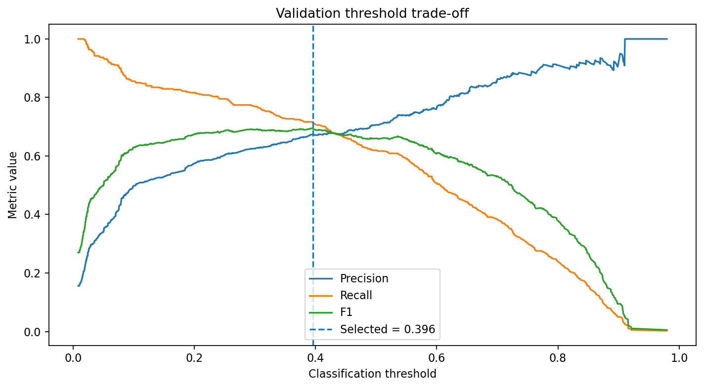
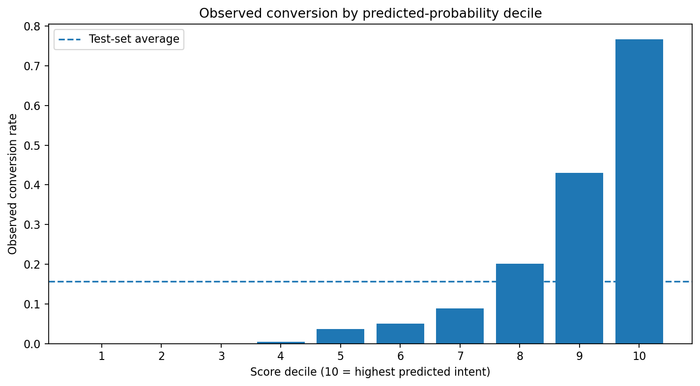
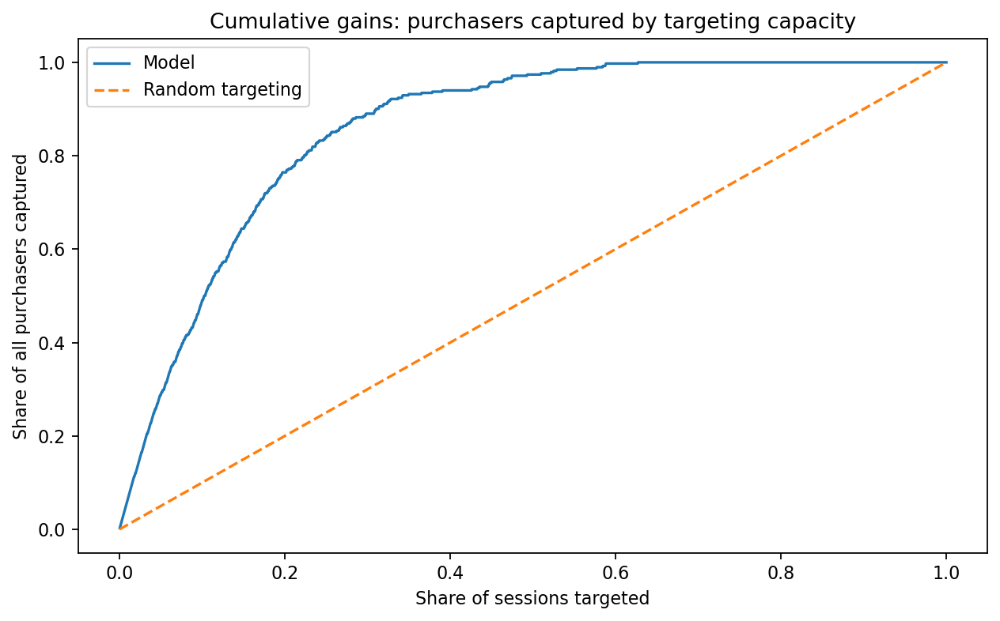
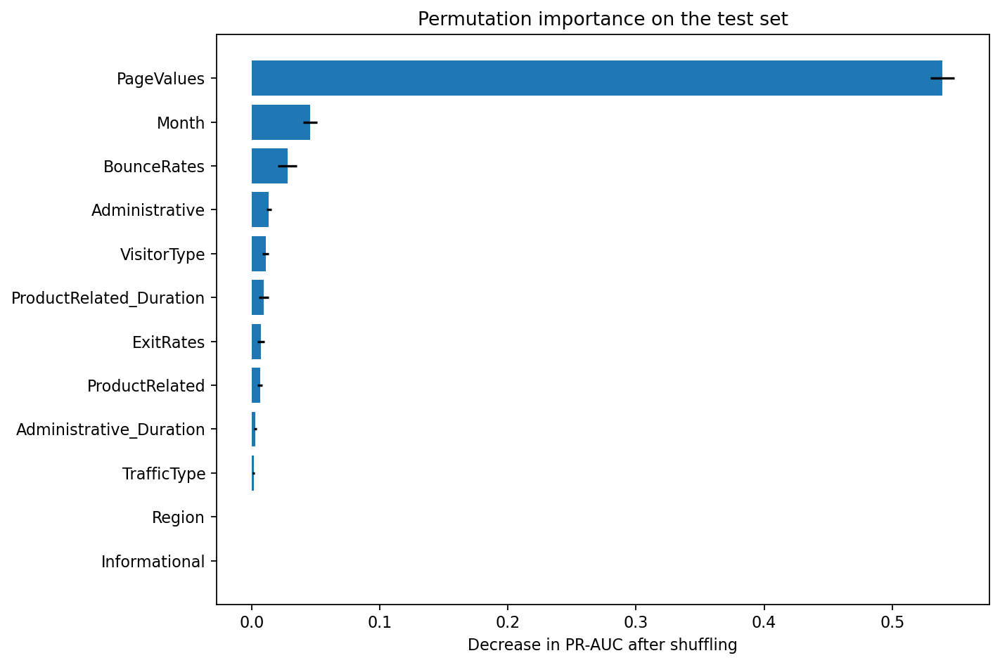
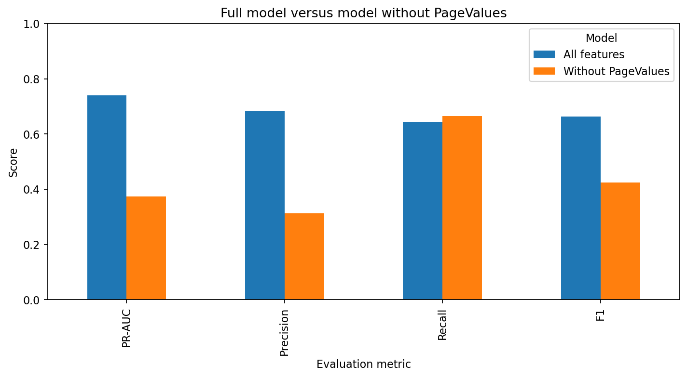

# Online Shopper Conversion Intelligence

A business-focused data science project that studies how online browsing behaviour relates to purchase conversion, then translates model performance into practical e-commerce decisions.

## Business problem

Most online sessions do not end in a purchase. The business challenge is therefore not simply to predict who will buy, but to answer a more useful question:

> **Where in the customer journey can the business intervene helpfully, without wasting service capacity or discounting customers who would have purchased anyway?**

This project follows that question from exploratory analysis through model evaluation, commercial interpretation and deployment recommendations.

---

## Executive takeaway

The model can rank late-stage purchase intent strongly. The highest-scored **10% of test sessions captured 49.0% of purchasers** and converted at **76.6%**, around **4.9 times the test-set average**.

However, most of this predictive strength depends on `PageValues`, a feature closely connected to activity immediately preceding a transaction. When it is removed, PR-AUC falls from **0.7393 to 0.3729**.

The main conclusion is therefore not that online purchases are easy to predict:

> **Late-stage intent is highly rankable, but early-stage persuasion is materially harder.**

Therefore, the recommended strategy is to use:

- an _early-assistance score_ for low-cost, helpful interventions;
- a _late-intent score_ for service prioritisation and capacity planning;
- controlled experiments to establish whether either action creates incremental conversion or margin.

---

# Main Business Insights

## 1. Conversion is uncommon, so the business cannot rely on accuracy alone

After removing 125 exact duplicate rows, the analytical dataset contains **12,205 sessions**. Only **15.6%** resulted in a purchase.



This creates two immediate business implications:

1. A model that predicts “no purchase” for every session would still appear to achieve approximately **84.4% accuracy**.
2. The useful question is not whether the model is broadly accurate, but whether it can identify a manageable group of sessions containing a large share of genuine purchase opportunities.

For that reason, the project prioritises **PR-AUC, precision, recall, lift and cumulative gains** rather than accuracy.

---

## 2. Purchasers do not merely browse more, they behave differently

Purchase sessions show a clearer progression through the shopping journey.

| Behaviour | Non-purchase median | Purchase median | Business interpretation |
|---|---:|---:|---|
| Product-related pages | 16 | 29 | Purchasers inspect a broader set of products |
| Product-related duration | 526 sec | 1,110 sec | Purchasers spend about twice as long considering products |
| Administrative pages | 1 | 2 | Purchase sessions contain more account or checkout-related activity |
| Exit rate | 0.0284 | 0.0160 | Purchasers are less likely to leave from a viewed page |
| Page value | 0.00 | 16.76 | Strong commercial-intent signal appears late in the journey |




### From browsing friction to purchase intent

The behavioural patterns suggest three practical stages in the online shopping journey:

| Journey stage | What the session looks like | Business interpretation | Recommended response |
|---|---|---|---|
| **1. Low engagement** | Few product pages viewed, limited browsing time and relatively high exit rates | The visitor may have weak purchase intent, poor landing-page fit or may have arrived through low-quality traffic | Improve acquisition targeting, landing-page relevance and site navigation before considering incentives |
| **2. Active exploration** | More products viewed and longer comparison time, but limited transaction-related activity | The visitor appears interested but may still face uncertainty, missing information or decision friction | Provide product comparisons, reviews, delivery details, stock guidance and optional live-chat support |
| **3. Late-stage intent** | Strong conversion-related behaviour, particularly elevated `PageValues` | The visitor is likely approaching a purchase and may require only minimal support | Prioritise checkout assistance and service availability, while avoiding unnecessary discounts |

This journey view reveals an important distinction: _the best action depends on when the visitor is identified._

Early in the journey, the goal is to reduce uncertainty and improve the shopping experience. Later in the journey, the goal shifts toward protecting a purchase that may already be close to completion.

For this reason, a model that performs well at identifying late-stage intent should not automatically be treated as an effective tool for early-session persuasion.

---

## 3. Context changes conversion, but segment differences are not automatically causal

Conversion also varies by visitor type, weekend status and month.

- **New visitors:** 24.9%
- **Returning visitors:** 14.1%
- **Weekend sessions:** 17.5%
- **Weekday sessions:** 15.1%
- **November:** 25.5%
- **February:** 1.7%



These patterns may help with staffing, campaign timing and performance monitoring, but they should not be interpreted as proof that being a new visitor, shopping on a weekend or visiting in November causes conversion.

For example:

- November may contain stronger commercial events or a different traffic mix.
- New visitors may arrive through high-intent acquisition channels.
- February contains relatively few observations, making its rate less stable.

The strategic lesson is to use these segments as context for monitoring and experimentation, not as shortcuts for customer value.

---

## 4. The model is commercially useful because it ranks sessions, not because it produces a perfect yes/no answer

Logistic Regression, Random Forest and Gradient Boosting were compared using a validation set. Gradient Boosting was selected and evaluated once on an untouched test set.

| Test metric | Result |
|---|---:|
| ROC-AUC | 0.9276 |
| PR-AUC | 0.7393 |
| Precision | 0.6833 |
| Recall | 0.6440 |
| F1 score | 0.6631 |
| Brier score | 0.0726 |

The classification threshold was reduced from 0.50 to approximately **0.3958**, increasing purchase recall from **55.2% to 64.4%** while reducing precision from **72.8% to 68.3%**.

This trade-off matters operationally:

- A customer-service team may prefer higher recall so fewer likely purchasers are missed.
- An expensive campaign may require higher precision so resources are not spread across too many false positives.
- There is no universally correct threshold. The choice depends on capacity, intervention cost and customer-experience risk.



---

## 5. The strongest value is concentration: a small share of sessions contains much of the purchase activity

The score separates high- and low-intent sessions clearly.



The top-scored decile converts at **76.6%**, compared with a test-set average of roughly **15.7%**. This represents a lift of nearly 4.9 times the average, showing that a team with limited capacity can prioritise a relatively small group of high-intent sessions rather than treating every visitor equally.

The cumulative gains view makes the capacity decision even clearer:

- the top **10%** of sessions captures **49.0%** of purchasers;
- the top **20%** captures **76.4%** of purchasers.



This supports practical decisions such as:

- how many sessions a live-chat team should prioritise;
- what share of traffic should receive enhanced assistance;
- how service capacity changes the number of likely purchasers reached.

But there is a crucial distinction:

> The model identifies customers likely to purchase. It does not identify customers whose behaviour will change because of an intervention.

The highest-scoring shoppers may already be committed to buying. For incremental growth, the more promising test group may be **medium-to-high intent sessions that show interest but still face friction**.

---

## 6. The apparent strength of the model changes when feature timing is considered

Permutation importance shows that `PageValues` is the dominant predictor.



This is strategically important because `PageValues` is calculated from pages viewed before a completed transaction. It may therefore become informative only near the end of the customer journey.

A sensitivity model was trained without `PageValues`:

| Model | ROC-AUC | PR-AUC | Precision | Recall | F1 |
|---|---:|---:|---:|---:|---:|
| All features | 0.9276 | 0.7393 | 0.6833 | 0.440 | 0.6631 |
| Without `PageValues` | 0.7827 | 0.3729 | 0.3120 | 0.6649 | 0.4247 |



The performance decline reveals the central commercial constraint:

- _Late-stage intent is easier to recognise_ because the session already contains strong purchase-adjacent signals.
- _Early-stage intent is harder to predict_ because the business must act before those signals appear.
- A single model should not be presented as equally useful at every point in the journey.

---

# Recommended business strategy

## Use two decision systems rather than one universal score

| Decision system | When it should be used | Suitable actions | Main caution |
|---|---|---|---|
| **Early-assistance score** | After a defined amount of browsing, before transaction-adjacent signals appear | Product guidance, delivery information, comparison tools, reviews, stock or size help, optional live chat | Lower precision means interventions must be cheap and non-intrusive |
| **Late-intent score** | Later in the session, after feature timing has been verified | Service prioritisation, checkout support, operational triage, post-session analysis | Avoid discounts that leak margin to customers already likely to buy |

## Prioritise friction reduction before incentives

The behavioural analysis points first toward reducing uncertainty and friction:

- clarify delivery and returns;
- improve product comparison;
- surface reviews and trust information;
- provide stock, size or availability guidance;
- offer checkout support;
- improve landing-page relevance.

_Discounts_ should only be tested where incremental contribution margin can be measured. A high conversion probability alone is not evidence that a discount is needed.

## Allocate actions according to capacity

Use score rankings and cumulative gains to set operational limits.

For example, a team able to support only 10% of sessions can reach roughly half of observed purchasers in the test data. Expanding to 20% reaches more than three quarters, but with progressively lower concentration.

The final threshold should therefore be selected using:

- team capacity;
- intervention cost;
- expected contribution margin;
- false-positive cost;
- customer-experience risk;
- the cost of missing a potentially assistable shopper.

---

# Model development

## Data preparation

The original dataset contains **12,330 rows and 18 variables**.

Quality checks found:

- no missing values;
- no invalid negative counts or durations;
- no rate variables outside their expected ranges;
- 125 exact duplicate rows, approximately 1.0% of the dataset.

Duplicates were removed before modelling to reduce the risk of identical records appearing in both training and test sets. Their origin is unknown, so this is a conservative modelling choice rather than proof that every duplicate is irrelevant.

## Evaluation design

The modelling workflow uses:

- a stratified **60% training, 20% validation and 20% test** split;
- preprocessing inside a `scikit-learn` pipeline;
- median imputation and standardisation for numeric variables;
- most-frequent imputation and one-hot encoding for categorical variables;
- validation PR-AUC for model selection;
- five-fold stratified cross-validation as a stability check;
- threshold selection using validation data only;
- one final evaluation on the untouched test set.

---

# Limitations

The project supports predictive prioritisation, not causal or financial conclusions.

- Each row represents a session, not necessarily a unique customer.
- There is no customer identifier or session timeline.
- Transaction value, margin and campaign cost are unavailable.
- The dataset contains no treatment or intervention variable.
- `PageValues` may be available too late for early intervention.
- A random split does not test performance on a genuinely later time period.
- Month, traffic, browser, region and operating-system codes may reflect hidden context or drift over time.
- Duplicate records are ambiguous.
- Results have not been validated on another website or later dataset.
- High propensity does not imply high incremental uplift.

The highest-value future data additions would be event timestamps, anonymous customer and session identifiers, basket value, contribution margin, intervention logs and a later-period holdout sample.

---

# Repository structure

`online-shopper-conversion-intelligence` is the project root:

```text
.
├── 01_data_quality_and_eda.ipynb
├── 02_modelling_and_evaluation.ipynb
├── data/
│   └── online_shoppers_intention.csv
├── outputs/
│   └── figures/
│       ├── 01_class_distribution.png
│       ├── 02_behavioural_distributions.png
│       ├── 03_conversion_rates_by_segment.png
│       ├── 04_correlation_matrix.png
│       ├── 05_validation_roc_and_pr_curves.png
│       ├── 06_cross_validation_stability.png
│       ├── 07_threshold_tradeoff.png
│       ├── 08_test_confusion_matrix.png
│       ├── 09_conversion_by_score_decile.png
│       ├── 10_cumulative_gains.png
│       ├── 11_calibration_curve.png
│       ├── 12_illustrative_value_by_threshold.png
│       ├── 13_permutation_importance.png
│       └── 14_pagevalues_sensitivity.png
└── README.md
```

---

# Installation

Using Anaconda:

```bash
conda create -n shopper-conversion python=3.11 -y
conda activate shopper-conversion
conda install -c conda-forge numpy pandas matplotlib scikit-learn jupyter ipython -y
```

Or using `pip`:

```bash
pip install numpy pandas matplotlib scikit-learn jupyter ipython
```

---

# Reproduce the project

1. Clone or download the repository.
2. Place `online_shoppers_intention.csv` in the project root or in `data/`.
3. Launch Jupyter:

```bash
jupyter notebook
```

4. Run the notebooks in order:

```text
01_data_quality_and_eda.ipynb
02_modelling_and_evaluation.ipynb
```

5. Keep `SAVE_FIGURES = True` to regenerate the PNG files in `outputs/figures/`.

The workflow uses `RANDOM_STATE = 7705` for reproducible splitting and model evaluation.
